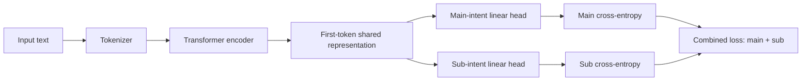
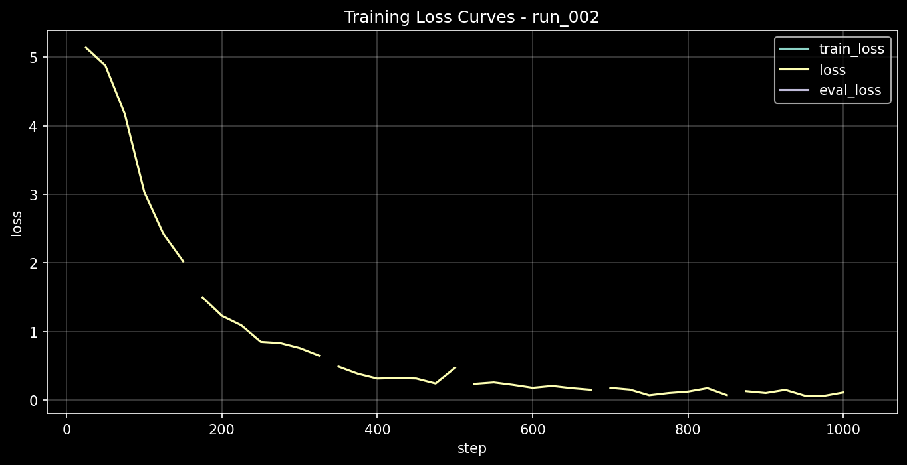

# Multi-Head Intent Classification

[](https://github.com/arushahmd/multihead-intent-classification/actions/workflows/ci.yml)

A multi-head transformer classifier for restaurant-ordering intent detection. A shared encoder predicts broad main intents and fine-grained sub-intents through independent classification heads, with leakage-resistant data splitting, reproducible experiment manifests, evaluation, and local inference.

This repository is a self-contained implementation derived from professional conversational-AI work, with historical evidence kept separate from the public sample data and current pipeline.

## Architecture



The labels are hierarchical: every sub-intent belongs to one main intent in [`configs/label_hierarchy.json`](configs/label_hierarchy.json). Prediction is nevertheless **multi-head**, not conditional. The sub-intent head does not receive the predicted main intent, and there is no hierarchy-constrained decoder. Evaluation and inference therefore report whether an independently predicted main/sub pair is valid.

## Why two heads?

A broad label such as `menu` or `cart` is useful for routing, while a fine-grained label such as `ask_item_price` or `change_quantity` is useful for selecting behavior. A shared encoder lets both tasks learn from the same utterance representation. Keeping the heads independent makes the historical architecture clear and provides an observable invalid-pair rate; it does not pretend to enforce the hierarchy.

## Engineering features

- Hugging Face-compatible configuration and serialization with an injected-encoder path for offline tests.
- Intentional pretrained-encoder loading; ordinary model construction does not resolve an encoder name over the network.
- Strict CSV and hierarchy validation, deterministic label IDs, normalized duplicate auditing, and contradictory-label rejection.
- Deterministic, approximately stratified group splitting that keeps normalized duplicate utterances in exactly one split.
- Run manifests with Git SHA, dataset and hierarchy hashes, split membership, seed, full configuration, runtime versions, model hash, and evaluation artifact hashes.
- Registry selection restricted to validation metrics; final/test metrics are report-only.
- Reusable main accuracy, sub accuracy, joint exact match, macro-F1, valid-pair rate, reports, and confusion matrices.
- Local batched inference with explicit device scope, confidence scores, deterministic labels, and invalid-pair flags.
- Offline unit tests and CI with no pretrained-model downloads or model training.

## Repository structure

```text
configs/                 Experiment template and canonical 5-main/34-sub hierarchy
data/sample/             Fictional schema and smoke-test examples
results/                 Curated historical aggregate evidence and limitations
scripts/                 Train, evaluate, and predict entry points
src/intent_classifier/   Data, model, training, evaluation, inference, and tracking package
tests/                   Offline unit and CLI tests
.github/workflows/       Lint and test CI
```

Generated runs go under `artifacts/runs/` and are ignored by Git.

## Installation

Python 3.10 or newer is supported.

```bash
python -m venv .venv
python -m pip install --upgrade pip
python -m pip install -e ".[dev]"
```

No pretrained weights are included. Installing the package does not download a model.

## Quickstart

Validate the public sample and inspect its deterministic split:

```bash
python -c "from intent_classifier.data import load_intent_csv, split_by_normalized_text; r=load_intent_csv('data/sample/intents.csv'); s=split_by_normalized_text(r, seed=42); print(len(r), len(s.train), len(s.validation), len(s.test))"
```

Inspect CLI options without training or loading a model:

```bash
python scripts/train.py --help
python scripts/evaluate.py --help
python scripts/predict.py --help
```

A training run defaults to local-only encoder resolution. If the configured encoder is not already cached, explicitly opt in to its download:

```bash
python scripts/train.py --config configs/experiments.yaml --experiment baseline_distilbert
# Add --allow-download only when network retrieval is intentional.
```

Evaluate or predict only from a saved local model directory:

```bash
python scripts/evaluate.py --model path/to/local-model --data path/to/labeled.csv \
  --hierarchy configs/label_hierarchy.json --output artifacts/evaluation

python scripts/predict.py --model path/to/local-model \
  --hierarchy configs/label_hierarchy.json --text "Show me the menu"
```

## Dataset disclosure

Input data uses three columns: `text`, `main_intent`, and `sub_intent`. The 102-row public sample contains fictional, generic language with three examples per retained sub-intent.

> **Public sample data is illustrative and is not the historical training dataset used for the reported archival experiments.**

The full historical training dataset is not distributed. The public splitter is also a methodological improvement, not a reconstruction of the historical split: it groups by normalized text to prevent duplicate utterances from crossing train, validation, and test.

## Historical results

No result below is presented as current model performance or a production benchmark. This repository does not contain the exact historical checkpoint, exact training CSV, split membership, or internal prediction rows.

### Historical internal split

**Historical experiment metrics — strongly evidenced but not end-to-end reproducible from the currently preserved artifacts.**

| Metric | Value |
| --- | ---: |
| Validation joint accuracy | `0.9310344827586207` |
| Test main accuracy | `0.9603448275862069` |
| Test sub accuracy | `0.9362068965517242` |
| Test joint accuracy | `0.9258620689655173` |

The preserved run records identify 3,865 examples split into 2,705 train, 580 validation, and 580 test rows with seed 42. Missing row membership and model artifacts prevent end-to-end reproduction.

### Historical common-set evaluation audit

| Metric | Value |
| --- | ---: |
| Main accuracy | `0.9543302180685358` |
| Sub accuracy | `0.6632398753894081` |
| Joint exact match | `0.6456697819314642` |

These aggregates were recomputed from preserved predictions over 16,050 rows. They are artifact-reproducible, but they are **not** an independent blind external test or clean generalization benchmark: the set overlaps historical training-source data, uses six main/37 sub labels versus the run's five main/34 sub labels, contains taxonomy changes, and was later used for model selection. The raw set and predictions are intentionally excluded.

See [`results/README.md`](results/README.md), [`results/historical_summary.csv`](results/historical_summary.csv), and [`results/error_analysis.md`](results/error_analysis.md) for evidence status and aggregate analysis.



## Reproducibility improvements

The historical workflow used row-level random splitting and did not preserve everything needed to recreate the strongest run. New runs address those gaps by recording:

- exact dataset bytes and row count;
- stable normalized-text group membership for every split;
- split seed and hierarchy hash;
- encoder identifier and complete hyperparameters;
- Git commit SHA when one exists;
- Python, platform, and dependency versions;
- saved-model and aggregate evaluation artifact hashes.

Model selection is restricted to validation metrics. Test metrics remain available for final reporting but cannot choose the best run.

## Tests and CI

```bash
pytest
ruff check .
```

Tests cover schema and hierarchy failures, duplicates, deterministic leakage-resistant splits, metric calculations, invalid hierarchy pairs, model shapes and combined loss with a tiny initialized encoder, experiment selection policy, safe report paths, package import, and CLI help. CI sets Transformers and Hugging Face Hub offline flags; it never trains a model or downloads pretrained weights.

## Historical provenance and licensing

The implementation preserves the central algorithmic and experiment-management ideas from the original professional project while excluding company-specific application code, operational data, model artifacts, and stale exploratory material. Historical aggregate evidence is separated from outputs that future runs may generate.

No license is included in this repository yet. Licensing information will be added separately if the project is published under an open-source license.
